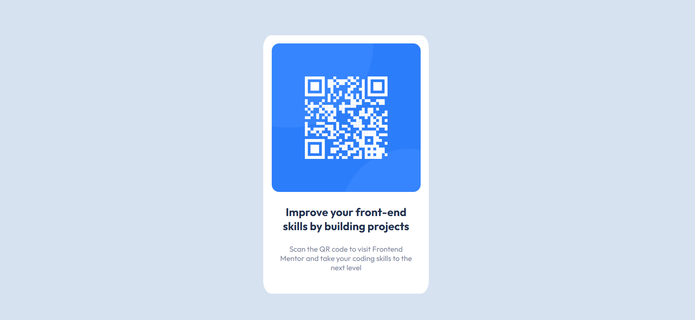

# Frontend Mentor - QR code component solution

This is a solution to the [QR code component challenge on Frontend Mentor](https://www.frontendmentor.io/challenges/qr-code-component-iux_sIO_H). Frontend Mentor challenges help you improve your coding skills by building realistic projects. 

## Table of contents

- [Overview](#overview)
  - [Screenshot](#screenshot)
  - [Links](#links)
- [My process](#my-process)
  - [Built with](#built-with)
  - [What I learned](#what-i-learned)
- [Author](#author)

## Overview

### Screenshot

### Links

- Preview URL: [Add live site URL here](https://tcaken.github.io/qr-code-component-main/)

## My process

### Built with

- HTML5
- CSS custom properties

### What I learned

In this challenge, i have applied some knowledges that i learned in past months. Thanks to Frontend Mentor (@FrontendMentor) that i can apply what i have learned to this challenge!

## Author

- Frontend Mentor - [@TCaken](https://www.frontendmentor.io/profile/TCaken)
- LinkedIn - (https://www.linkedin.com/in/tan-caken-350275181)
